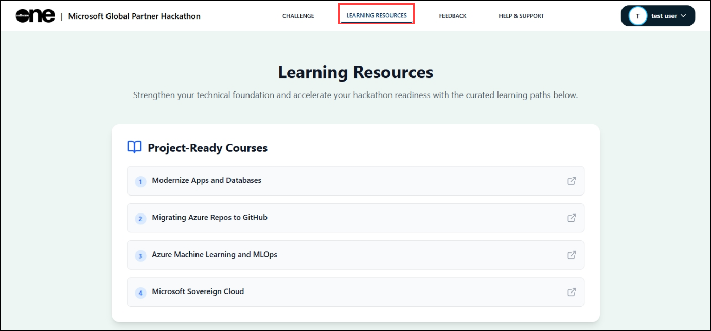
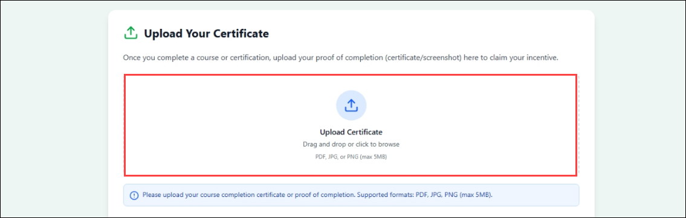

## Day 02

# Challenge 2: CI Pipeline Implementation with Quality Thresholds (Monolithic Application)

## Goal

Design and implement a multi-stage CI pipeline for the monolithic application with enforced validation checks and controlled stage progression.

This challenge focuses on establishing structured pipeline execution where progression is based on defined quality thresholds rather than automatic advancement.

---

## Challenge Overview

With infrastructure now provisioned, the next step is to enable controlled application delivery.

In this challenge, you will:

- Create a YAML-based pipeline in Azure DevOps.
- Implement a multi-stage design.
- Introduce validation mechanisms that determine whether the pipeline progresses.
- Ensure that failure scenarios correctly block deployment readiness.

The objective is to enforce discipline within the CI process and ensure only validated builds move forward.

---

## Objectives

### 1. Create a YAML-Based Multi-Stage Pipeline

- Define a CI pipeline using YAML.
- Configure triggers for appropriate branch execution.
- Structure the pipeline into at least two logical stages.
- Ensure pipeline definition is version-controlled within the repository.

Outcome:
A structured, version-controlled multi-stage CI pipeline is implemented.

> Note: You are not limited to two stages. You may design additional stages (for example: build, test, security scan, containerize, validate) as long as controlled progression is clearly enforced.

---

### 2. Stage 1 – Build & Validation

Stage 1 must include:

- Application build process.
- Execution of automated tests.
- Integration of code quality and/or security analysis using any chosen tool (e.g., SonarQube, OWASP Dependency Check, or equivalent).
- Clear criteria that determine whether the pipeline can progress to the next stage.

You must define any measurable thresholds such as:

- Test pass percentage.
- Zero critical vulnerabilities.
- Defined quality score baseline.
- Build success conditions.

If thresholds are not met, the pipeline must stop.

Outcome:
Stage 1 validates the application and enforces quality gates before progression.

---

### 3. Stage 2 – Deployment Readiness

Stage 2 must execute only if Stage 1 completes successfully and defined thresholds are satisfied.

This stage should:

- Confirm containerization or artifact packaging (as applicable).
- Validate readiness for deployment to the selected endpoint.
- Ensure the pipeline status clearly reflects successful execution.

No automatic progression is allowed without satisfying Stage 1 conditions.

Outcome:
Controlled progression ensures only validated builds reach deployment readiness.

---

### 4. Validate Pipeline Behavior

- A successful end-to-end pipeline run.
- A failed scenario where thresholds block progression.
- Clear visibility of pipeline status.
- Evidence that stage execution is dependent on validation criteria.

Outcome:
Pipeline behavior aligns with defined quality and control expectations.

---

### 5. Application Endpoint Validation

Once the pipeline completes successfully:

- Access the deployed application using the configured endpoint.
- Validate basic application functionality.
- Perform a simple end-to-end action such as adding a product to the cart.
- Confirm that the application behaves as expected in the deployed environment.

Outcome:
The application is not only built and validated in the pipeline but is also functionally verified post-deployment.

## Expected Outcomes

By the end of Challenge 2:

- A YAML-based multi-stage CI pipeline is implemented.
- Stage 1 enforces build, testing, and quality/security validation.
- Thresholds are defined and actively enforced.
- Stage 2 executes only when criteria are satisfied.
- Pipeline success status is clearly visible.
- Failure scenarios correctly prevent stage progression.

---

## Completion Criteria

Please use the instructions provided below and follow the submission steps carefully:

Once you complete this challenge, you must:

1. Keep the below artifacts ready to be uploaded:

   - A screenshot of a successful end-to-end pipeline execution.
   - A screenshot showing a basic functional validation (e.g., adding a product to the cart)

1. Name the screenshot using the below naming convention:

   - `<Your_Name>_<Challenge02>_<file01>_<Time_Stamp(HH:MM)>`
   - `<Your_Name>_<Challenge02>_<file02>_<Time_Stamp(HH:MM)>`

1. Navigate back to **Hackathon Portal** where you registered for the hackathon.

1. In the hackathon portal, select **Learning Resources** page.

   

1. Scroll down to bottom, under **Upload Your Certificate**, click **upload Certificate** and upload the artifacts that you have prepared earlier.

   

This submission is mandatory.

Failure to submit these artifacts will result in the challenge being marked as incomplete.

This submission will serve as validation that controlled CI implementation has been successfully achieved.

## Congratulations! You have successfully completed Challenge 2