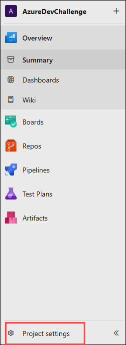
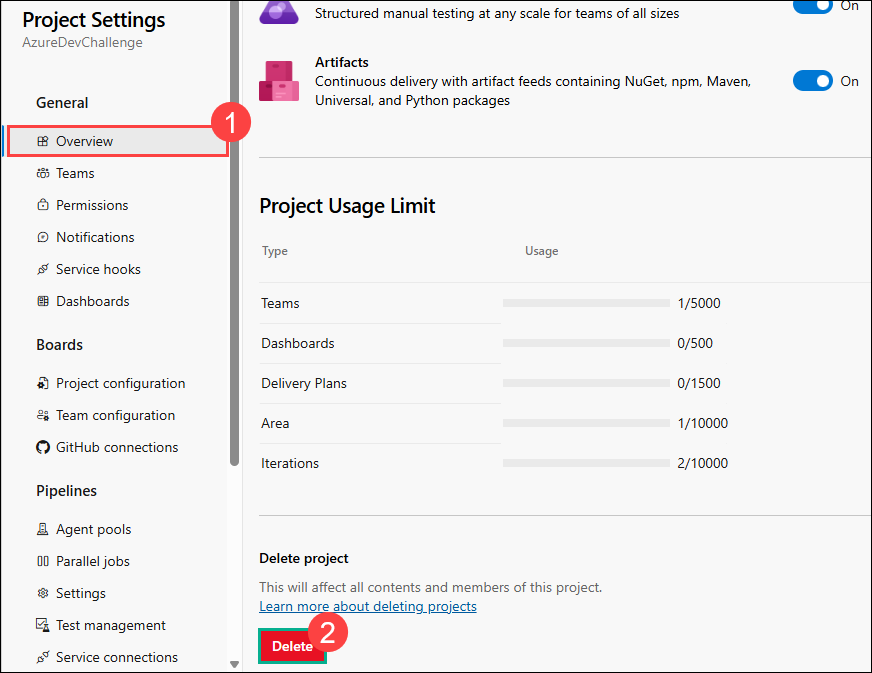
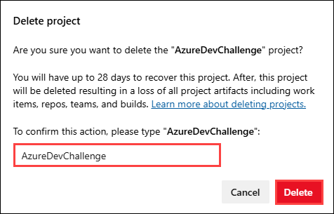
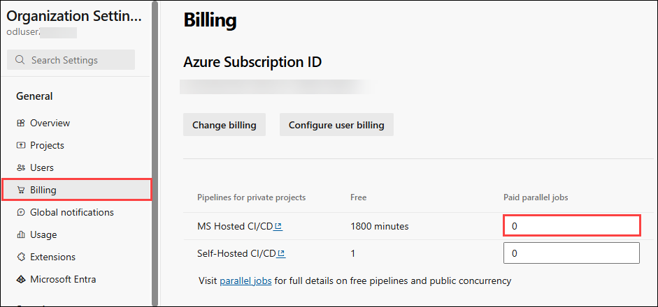
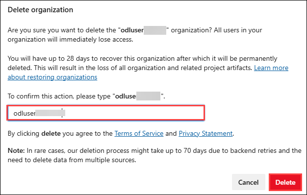

# Cleanup: Remove Azure DevOps Organization and Project

## Overview

In this section, you will clean up the Azure DevOps resources that were created during this hackathon.

The following steps will help you remove your Azure DevOps project and organization to ensure that no unnecessary resources remain active. Performing this cleanup is important to avoid unintended usage, prevent additional billing charges, and maintain a clean development environment.

Please complete the steps in this section once you have finished the hackathon to ensure that all related resources are properly removed.

## Steps to Complete

1. On your project's main page, click on **Project settings** from the left menu.

   

1. In the overview page, scroll down and select **Delete** to delete your project.

   

1. In the confirmation pane, provide the name of your project and click on **Delete**.

   

1. In the organization pane, select organization settings from the left menu.

1. Select **Billing** from the left menu and set the **MS Hosted CI/CD** value to **0**.

   

1. Scroll down and click on **Save** to save the settings.

1. From the overview page, sroll down and click on **Delete** to delete the organization.

   

1. In the confirmation pane, provide the name of your organization and click on **Delete**.

   

1. Now, you have cleaned up your Azure DevOps successfully!

