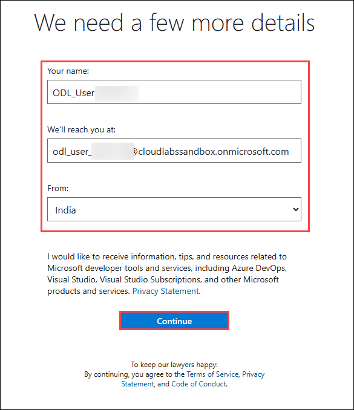
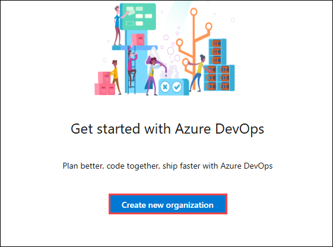
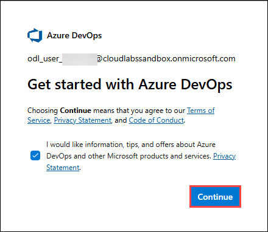
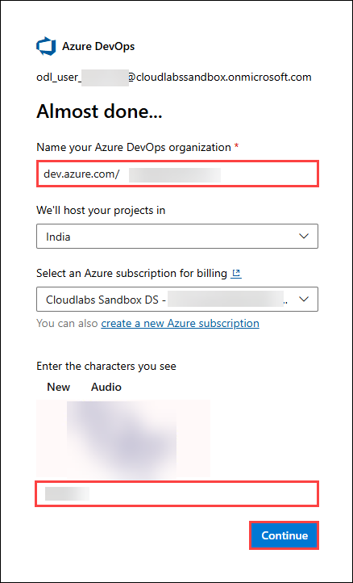
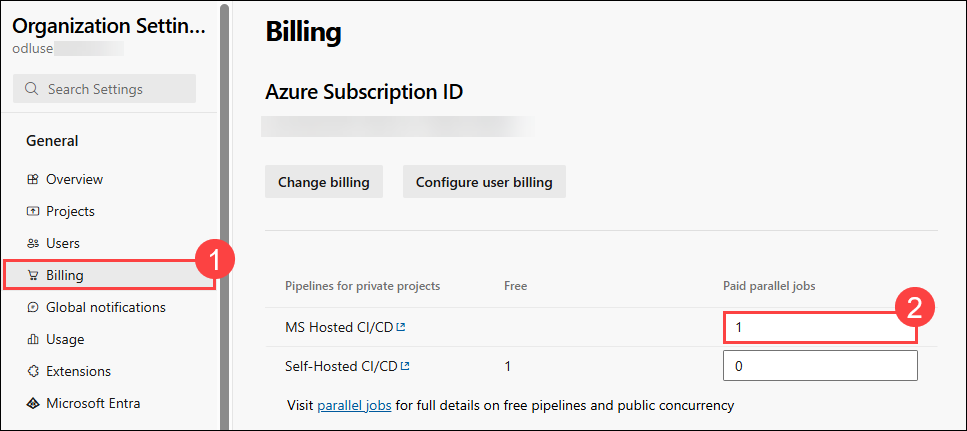
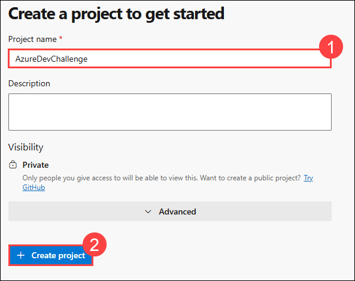
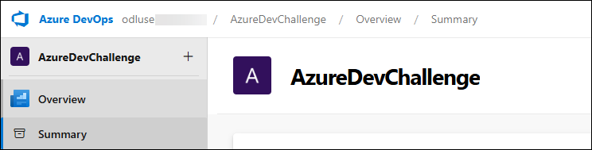

## Getting Started with Challenge

We've prepared a seamless environment for you to explore and learn. Let's begin by making the most of this experience.

### Accessing Your Challenge Environment

Once you're ready to dive in, your virtual machine and challenge guide will be right at your fingertips within your web browser.


### Exploring Your Challenge Resources

To get a better understanding of your challenge resources and credentials, navigate to the Environment tab.


### Utilizing the Split Window Feature

For convenience, you can open the challenge guide in a separate window by selecting the Split Window button from the Top right corner


### Managing Your Virtual Machine

Feel free to start, stop, or restart your virtual machine as needed from the Resources tab. Your experience is in your hands!


> **Note:** If the VM is not in use, please **deallocate** it to avoid unnecessary resource consumption.

## Let's Get Started with Microsoft Azure

1. In the JumpVM, click on **Azure Portal** browser shortcut which is created on desktop.

   

1. On the **Sign into Microsoft** tab, you will see the login screen. Enter the provided email or username, and click **Next** to proceed.

   - Email/Username: <inject key="AzureAdUserEmail"></inject>

     

1. Now, enter the following Temporary Access Pass and click on **Sign in**.

   - Temporary Access Pass: <inject key="AzureAdUserPassword"></inject>

     
     
1. If you see the pop-up **Stay Signed in?**, click No.

   

## Set Up Azure DevOps for Hackathon

1. Open a new browser tab and navigate to Azure DevOps using the following link:

   ```
   https://aex.dev.azure.com
   ```

1. If prompted to sign in, log in using the same credentials you used to access Azure. After signing in, leave all settings as default and click **Continue**.

   

1. On the next screen, select **Create new organization**.

   

1. On the **Get Started with Azure DevOps** page, click **Continue**.

   

1. On the **Almost done...** page, provide a name for your organization. Under **Enter the characters you see**, type the characters exactly as displayed. Then click Continue.

   

1. Once your organization is created, in the left pane, click on **Organization settings**.

   

1. In the **Organization Settings** page, select **Billing (1)** from left menu, set the value to **1** for **MS Hosted CI/CD**.

   
   
   >Ensure you select only one parallel job, as increasing this number will directly affect your allocated credits.

1. Scroll down and click on **Save** to save the settings.

1. After updating the billing settings, select your organization name from the top navigation bar to return to the main page.

   

1. On the **Create a project to get started**, provide a name of your choice and click on **+ Create project (2)** 

   

1. Your project is now created, and the prerequisites are complete. You may proceed with the challenge.

   

Now, click on the **Next** from lower right corner to move on next page.

## Happy Hacking!!